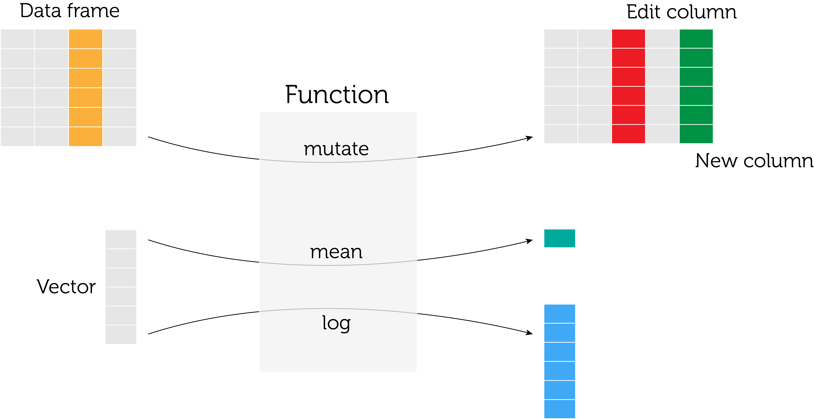

### -1. Setup

Load packages
```{r setup, warning=FALSE, message=FALSE}
# Set default alignment of figures
knitr::opts_chunk$set(fig.align = "center")

# Data manipulation
library(dplyr)
library(tidyr)
library(readr)

# Data inspection
library(mice)

# Data visualiation
library(ggplot2)
library(qqplotr) # for QQ-plots, a ggplot2 extension
library(patchwork) # for patching together plots, very powerful and simple to use (highly recommended)
theme_set(theme_minimal()) # sets default theme for ggplots
```

### 0. Brief intro and R quirks
There are some things to be aware of when using R (or any other programming language) and knowing how R behaves and handles certain situations can help you find errors in your code. Don't lose hope! It seems irrelevant but can save you hours of debugging or googling mysterious error messagges, in the long run.

```{r}
# Sequences
c(1, 2, 3, 4, 5, 6)
1:6
seq(1, 6) # seq() allows for more elaborate sequences when needed, see ?seq

# Vectorised computations, vectors are repeated which can give incorrect results
c(1, 2, 3, 4, 5, 6) * 2 # element-wise (many x 1)
c(1, 2, 3, 4, 5, 6) * c(1, 1, 2, 2) # repeats the second vector 1.5 times (gives a warning, though)
c(1, 2, 3, 4, 5, 6) * c(1, 2, 3) # repeated the second vector twice, then element-wise
log(c(1, 2, 3, 4, 5, 6)) # element-wise

# Strings vs. numbers
x <- "2"
y <- 2
try(x * 2) # error, it's not a number (I have to put it inside try() so the error doesn't hault the script)
y * 2 # all good, it's a number

x <- c("1", "22", "3", "2", "10")
y <- c(1, 22, 3, 2, 10)
sort(x) # start from the beginning of the word (so, "10" come before "2")
sort(y) # knows that these are number, so sorting is correct
parse_number(x) %>% # nifty function from the readr package to numbers written as strings to actual numbers
	sort() 
```

#### Piping
At its core, R is a so-called functional programming language. This just means that the everything you do is based on the use of functions. A function takes one input (sometimes more), does something with that input, and spits out the result. You can often affect what the function does with the other arguments (e.g. `na.rm` in `mean` ensures that missing values (`NA`s in R) are ignored.) This can be depicted like this:

```{r, out.width="75%"}

```

Knowing that the *first* argument of the function is usually the input (be it a vector, dataframe or a single value) is important to exploit the so-called pipe operator. The pipe (`%>%`; Mac: cmd + shit + M, Windows: ctrl + shift + M) takes the output from the function (or directly an object, e.g. a dataframe or vector) on its left-hand side and uses that as the *first* input to it function on its right-hand side. Usually you add a newline after the pipe to give the code some structure (and you'll see that Rstudio automatically indents the next line to aid the eye):
```{r}
x <- c(1, 2, 3, 4, 5, 6, NA)
x %>% 
	mean(na.rm = TRUE)

# is the same as
mean(x, na.rm = TRUE)

# is the same as
c(1, 2, 3, 4, 5, 6, NA) %>% 
	mean(na.rm = TRUE)
```

In this particular example, the pipe isn't all that useful, but even slightly more involved manipulation can make the code a lot more readable (and, thus, less prone to errors):
```{r}
x <- c(1, 2, 3, 4, 5, 6, NA)
x %>% 
	na.exclude() %>% 
	log() %>% 
	mean()

# is the same as
mean(log(na.exclude(x)), na.rm = TRUE)
```

Brevity should never hurt clarity, so it's better to write longer code which is easier to read and understand. Especially for data analytics where your target reader is unlikely to be an experienced programmer.

#### Missing data
In R missing data are represented by `NA`, and you must use the function `is.na()` to find `NA`'s; it's an error to try e.g. `x == NA` because something cannot be equal to something that isn't there. Even two things that aren't there cannot be compared because there's no logical way to do that.
```{r}
NA == NA # gives NA
is.na(NA) # gives TRUE
!TRUE # gives FALSE because the exclamation negates TRUE/FALSE statements in R
!c(TRUE, FALSE, TRUE, FALSE) # they become opposite
!is.na(NA) 
!is.na(x) # all except the last are not NA
x[!is.na(x)] # pick only the values that are NA
```


#### `dplyr`
`dplyr` is built around a number of function with meaningful verb names, each with a specific purpose in data manipulation. First, a dummy data frame for the example:
```{r}
d <- data.frame(x = c(1, 2, 3, 4, 5, 6), y = c("a", "b", "c", "c", "b", "a"))
```

Then the verbs:
```{r}
# mutate() changes the columns or adds new ones; doesn't change the number of rows
d %>% 
	mutate(z = x * 2) # add new column based exisiting column(s)
d %>% 
	mutate(x = x * 2, # overwrites the x column in place
		   z = x * 2) # so the z column is now actually: x * 2 * 2

# transmute() works like mutate() but only retains column modified
d %>% 
	transmute(z = x * 2)

d %>% 
	transmute(x, # just putting the variable there keeps the variable as-is of no modification needed
			  z = x * 2)

# rename()
d %>% 
	rename(new_x = x)

d %>% 
	rename(new_x = x,
		   new_y = y)

# select() does what it sounds like, it selects columns
d %>% 
	select(y)

d %>% 
	select(-x) # use a minus to remove columns

d %>% # let's build a little chain of manipulations
	mutate(z = x * 2) %>% 
	select(x, z)

d %>% 
	mutate(z = x * 2,
		   u = log(z)) %>% 
	select(y:u) # use colon for a range of column names without writing each of them

d %>% 
	select(new_x = x, # you can also rename while selecting
		   y) 

# filter() allows you to keep only rows that satisfy certain criteria
d %>% 
	filter(y == "b") # use the double equal sign for matching with one value

d %>% 
	filter(y %in% c("b", "c")) # and %in% if the column can have several values

d %>% 
	filter(x > 3,
		   y == "b") # empty data frame because no results satisfy both criteria

d %>% 
	filter(x == 1 | y == "b") # the vertial line is a logic OR, so rows satisfying any of the criteria are kept

d %>% 
	filter(between(x, 1, 3)) # keeps rows in which the x value is in the range [1, 3] (so bounds included)

d %>% 
	mutate(z = x * 2) %>% 
	filter(y %in% c("b", "c")) %>% 
	select(x, z)

# arrange() sorts the data by any number of columns
d %>% 
	arrange(x, y) # same as d, becaue sorting happens from the left

d %>% 
	arrange(y, x)

d %>% 
	arrange(desc(x)) # desc() causes sorting in descending order

# summarise() reduces the data frame (or group) to 1 row (it has more flexible use that we ignore for now)
d %>% 
	summarise(mean_x = mean(x)) # only columns that are summarised remain

d %>% 
	summarise(mean_x = mean(x),
			  sd_x = sd(x)) # you can compute several summaries of the same column

d %>% 
	mutate(z = x * 2) %>% 
	summarise(mean_x = mean(x),
			  sd_x = sd(x),
			  mean_y = mean(z),
			  sd_z = sd(z),
			  median_z = median(z)) # and you can summarise any number of columns

# group_by() splits the dataframe into groups by column values, behind the scenes (so to you it will look the same)
d %>% 
	group_by(y)

d %>% 
	group_by(y) %>% 
	summarise(mean_x = mean(x)) # summarise gives group-wise summaries (ignore the warning)
```

The salient point is that, with the `dplyr` verbs and the pipe (`%>%`) you can make chains as long as you need them to be. Data frames are so-called immutable so the `d` dataframe is the same as we defined in the very top of the code before, because all these little pipe chains aren't saved anywhere. 
```{r}
d

d_new <- d %>% 
	mutate(z = x * 2) %>% 
	filter(y %in% c("b", "c")) %>% 
	select(x, z)

d # d remains
d_new # but the chain result is now saved in d_new

d <- d %>% 
	mutate(z = x * 2) %>% 
	filter(y %in% c("b", "c")) %>% 
	select(x, z)

d # now we have ovewritten the old d with the chain result
```

And I think we're ready for the exercise.

### -1. Setup (cont'd) - helper functions
Define helper functions (if you do the same or almost the same thing more than twice, you should create a function for that specific task.) `tribble` is a way to create dataframes row-wise; `pivot_longer` and `pivot_wider` come from the `tidyr` package and allows for converting between long and wide format (more on this later in the course).

```{r}
summary_stats <- function(x) {
	"
	x: vector of continuous values
	"
	tribble(
		~ statistic, ~ value,
		"mean", mean(x, na.rm = TRUE),
		"std_dev", sd(x, na.rm = TRUE),
		"median", median(x, na.rm = TRUE),
		"p25", quantile(x, probs = 0.25, na.rm = TRUE),
		"p75", quantile(x, probs = 0.75, na.rm = TRUE),
		"min", min(x, na.rm = TRUE),
		"max", max(x, na.rm = TRUE),
		"n_missing", sum(is.na(x))
	)
}

pivot_around_sex <- function(df) {
	"
	df is a data frame with at least a column named sex and some data columns to pivot
	"
	df %>% 
		pivot_longer(cols = -sex, names_to = "statistic", values_to = "value") %>% 
		pivot_wider(names_from = "sex")
}
```

### 1. Data wrangling
Remember that `transmute` discards all columns not modified or referenced ("mentioned") in the call. It's an easy to do wrangling + renaming of incoming data while throwing away the old columns. I prefer to keep all data wrangling together, but you find out as you go what you need: it's an iterative process, and so it makes sense to come back and add the data wrangling here when you realise you need something (e.g. BMI in this example).

```{r data_wrangling}
df <- read_delim("http://staff.pubhealth.ku.dk/~sr/BasicStatistics/datasets/sundby.txt", delim = " ", na = ".") %>% 
	transmute(weight = v75,
			  height = v76 / 100, # cm ~> metres
			  sex = factor(kon, levels = c(1, 2), labels = c("male", "female")),
			  bmi = weight / height^2)

glimpse(df) # gives a nice overview of the actual values in the dataframe ≠ summary()
```

Get a few summary stats; we have `r nrow(df)` observations with `r ncol(df)` variables.
```{r}
summary(df)
```

#### Pattern in missingness
The rows are missingness pattern (0 = variable is missing). The left-most column is the number of patients with the respective missingness patters, the right-most column the number of variables missing in each pattern, the bottom-most row the number of participants with missing values for the respective variables.

```{r}
md.pattern(df, plot = FALSE)
```

### 2. Weights of men and women
The weight distributions seem to differ although they do overlap quite a lot.

#### Numerical summary
```{r}
df %>% 
	group_by(sex) %>% 
	summarise(summary_stats(weight)) %>% # note that summarise() here actually reduces to >1 row
	arrange(statistic, sex)
```

#### Plotting

QQ-plot
```{r}
ggplot(df, aes(sample = weight, colour = sex)) +
	geom_abline(intercept = 0, slope = 1, size = 0.25) + # the name comes from the equation: y = ax + b
	stat_qq_point(size = 0.5) # from qqplotr
```


First a histogram of the weight distribution overall. Note: different values of `binwidth` will change the appearance quite a lot (as all histograms)
```{r}
ggplot(df, aes(x = weight)) +
	geom_histogram(binwidth = 5)
```

We often want to show men and women separately. The "naive" approach seems weird because `ggplot2` stacks histograms by default.
```{r}
ggplot(df, aes(x = weight)) +
	geom_histogram(aes(fill = sex), binwidth = 5)
```

So we tell `ggplot2` to dodge (= "unstack") the bars
```{r}
ggplot(df, aes(x = weight)) +
	geom_histogram(aes(fill = sex), binwidth = 5, position = "dodge")
```

It's definitely better, but it can be a bit tricky to compare distributions without the same number of observations because the modes won't be of equal height. Using `table` we can see that there are about 21% more women than men.
```{r}
table(df$sex) # many more females, so a crude histogram might be misleading
```

--so we want "normalised" histograms instead. `ggplot2` computed some values (which ones depends on the `geom`), and these can be called surrounding them by two periods (see e.g. `?geom_histogram`)
```{r}
ggplot(df, aes(x = weight)) +
	geom_histogram(aes(fill = sex, y = ..ncount..), binwidth = 5, position = "dodge")
```

I think multiple histrograms together are ugly and prefer to plot the frequencies as lines instead (= frequency polygons in `ggplot2`; weird name, pretty plot). I add some plot cosmetics to have a nice-looking and near publication-ready plot:
```{r}
ggplot(df, aes(x = weight, colour = sex, y = ..ncount..)) +
	geom_freqpoly(binwidth = 5, size = 0.25) +
	stat_bin(size = 0.5, binwidth = 5, geom = "point", position = "identity") +
	labs(x = "Weight in kilograms", y = "No. participants as fraction of maximum count") +
	theme(axis.text.y = element_blank())
```

#### Alternatives
Violin plots are richer than boxplots and can unearth patterns in the distribution that escape boxplots. Their appearance depends heavily on their settings so be careful. 

```{r}
ggplot(df, aes(x = sex, y = weight, fill = sex)) +
	geom_violin(size = 0.4) 

ggplot(df, aes(x = sex, y = weight, fill = sex)) +
	geom_boxplot(size = 0.4) 
```

### 3. Construct reference intervals

#### On the "cirka 2" factor
Often, you can just use 2 or 1.96 (because the $t$ distribution gets closer to the Normal as N becomes large). This is just to show the relationship between the "circa 2"-factor and the number of observations. `tibble`s are a modern version of dataframes (they arrived with `dplyr`) and offer three nice features: columns are created "on-the-fly" so you can use values from previous columns to create a new one (this is not possible with `data.frame()`), they print in a nice way (unlike dataframes; this becomes more important for larger dataframes/tibbles), they don't convert strings to factors automatically (the `read_*()` functions from `readr` have the same feature unlike the `read.*()` in base R). As we can see, already for around 100 observations, the 1.96 approximation is quite good.
```{r}
tibble(n_obs = 2:200, # n_obs = 1 is meaningless as a single observation can't have a distribution
	   circa_2 = (1 + 1/n_obs) * qt(0.975, n_obs - 1)) %>% 
	ggplot(aes(x = n_obs, y = circa_2)) +
		geom_hline(yintercept = qt(0.975, Inf), colour = "orange", linetype = 2, size = 0.5) +
		geom_line(size = 0.2) +
		geom_point(size = 0.2) +
		scale_x_log10() +
		scale_y_continuous(breaks = c(round(qt(0.975, Inf), 2), 5, 10, 15, 20))
```

### Using the Normality assumption
```{r}
df %>% 
	filter(!is.na(weight)) %>% # keep the rows where weight is *not* missing
	group_by(sex) %>%
	summarise(mean = mean(weight),
			  std_dev = sd(weight),
			  interval_factor = sqrt(1 + 1/n()) * qt(0.975, n() - 1),
			  ci_lo_norm = mean - interval_factor * std_dev,
			  ci_hi_norm = mean + interval_factor * std_dev,
			  ci_lo_nonnorm = quantile(weight, 0.025),
			  ci_hi_nonnorm = quantile(weight, 0.975)) %>% 
	pivot_around_sex() # this is just cosmetics so the results fit better
```

### 5. Scatterplot of weight ~ height
The simple scatterplot looks nice but is actually deceiving.
```{r}
ggplot(df, aes(x = weight, y = height, shape = sex, colour = sex)) +
	geom_point()
```

If we make the points transparent, we see many points are plotted on top of each other (over-plotting) which means the first opaque scatterplot is "hiding" observations. Making points semi-transparent helps (`alpha = 1` is fully opaque, `alph = 0` is fully transparent):
```{r}
ggplot(df, aes(x = weight, y = height, shape = sex, colour = sex)) +
	geom_point(alpha = 0.5)
```

But we can also try a heatmap-plot (note again the use of a computed value surrouned by two periods, here `..ncount..`)
```{r}
ggplot(df, aes(x = weight, y = height)) +
	geom_hex(aes(alpha = ..ncount.., fill = sex), bins = 40)
```

A contour plot is perhaps less confusing than the heatmap plot because overlaying of colours isn't handled well.
```{r}
ggplot(df, aes(x = weight, y = height, colour = sex)) +
	geom_density_2d(size = 0.25) 
```

### 6. BMI

The distribution seems about right: right-skewed, with some extreme values but mostly in the normal range. BMI doesn't seem to have a Normal distribution, however. I'm overlaying the plot with the density of the Normal distribution that we assume based on the mean and standard deviation (blue curve). If this is too difficult, just dont' try to understand the `stat_function` line and we'll come back to it later in the course. 

```{r}
df_bmi <- df %>% 
	filter(!is.na(bmi))

ggplot(df_bmi, aes(x = bmi)) +
	geom_histogram(aes(y = ..density..), colour = "white", fill = "grey80", binwidth = 1) +
	geom_density() +
	stat_function(colour = "dodgerblue", fun = dnorm, args = list(mean = mean(df_bmi$bmi), sd = sd(df_bmi$bmi))) 
```

The QQ-plot is also off
```{r}
ggplot(df_bmi, aes(sample = bmi)) +
	geom_abline(intercept = 0, slope = 1) +
	stat_qq_point()
```

However, it might be misleading to plot men and women together:
```{r}
df_men <- df_bmi %>% 
	filter(sex == "male") 
df_women <- df_bmi %>% 
	filter(sex == "female")

p_men <- ggplot(df_men, aes(x = bmi)) +
	geom_histogram(aes(y = ..density..), colour = "white", fill = "grey80", binwidth = 1) +
	geom_density() +
	stat_function(colour = "dodgerblue", fun = dnorm, args = list(mean = mean(df_men$bmi), sd = sd(df_men$bmi))) +
	labs(title = "Men")

p_women <- ggplot(df_women, aes(x = bmi)) +
	geom_histogram(aes(y = ..density..), colour = "white", fill = "grey80", binwidth = 1) +
	geom_density() +
	stat_function(colour = "dodgerblue", fun = dnorm, args = list(mean = mean(df_women$bmi), sd = sd(df_women$bmi))) +
	labs(title = "Women")

p_men + p_women # the patchwork package allows us to patch together plots like this
```

Or as the frequency polygon instead:
```{r}
ggplot(df_bmi, aes(x = bmi, colour = sex)) +
	geom_freqpoly(binwidth = 1)
```

### Determine normal ranges for each sex with and without normality assumption
Note that use of `sum` and `mean` of TRUE/FALSE vectors (whether BMI is between the lower and higer bounds of the reference intervals.)

```{r}
df_bmi %>%
	group_by(sex) %>%
	summarise(mean = mean(bmi),
			  std_dev = sd(bmi),
			  interval_factor = sqrt(1 + 1/n()) * qt(0.975, n() - 1), # = circa 2
			  ci_lo_norm = mean - interval_factor * std_dev,
			  ci_hi_norm = mean + interval_factor * std_dev,
			  n_outside_ci_norm = sum(!between(bmi, ci_lo_norm, ci_hi_norm)),
			  prop_outside_ci_norm = mean(!between(bmi, ci_lo_norm, ci_hi_norm)),
			  ci_lo_nonnorm = quantile(bmi, 0.025),
			  ci_hi_nonnorm = quantile(bmi, 0.975),
			  n_outside_ci_nonnorm = sum(!between(bmi, ci_lo_nonnorm, ci_hi_nonnorm)),
			  prop_outside_ci_nonnorm = mean(!between(bmi, ci_lo_nonnorm, ci_hi_nonnorm))) %>% 
	pivot_around_sex() # again, just cosmetics
```

### 7. Using log-BMI
Better agreement between intervals based on normality assumption and empirical estimates. 
```{r}
df_bmi %>% 
	mutate(log_bmi = log(bmi)) %>% 
	group_by(sex) %>%
	summarise(mean = mean(log_bmi),
			  std_dev = sd(log_bmi),
			  interval_factor = sqrt(1 + 1/n()) * qt(0.975, n() - 1),
			  ci_lo_norm = exp(mean - interval_factor * std_dev),
			  ci_hi_norm = exp(mean + interval_factor * std_dev),
			  n_outside_ci_norm = sum(!between(bmi, ci_lo_norm, ci_hi_norm)),
			  prop_outside_ci_norm = mean(!between(bmi, ci_lo_norm, ci_hi_norm)),
			  ci_lo_nonnorm = exp(quantile(log_bmi, 0.025)),
			  ci_hi_nonnorm = exp(quantile(log_bmi, 0.975)),
			  n_outside_ci_nonnorm = sum(!between(bmi, ci_lo_nonnorm, ci_hi_nonnorm)),
			  prop_outside_ci_nonnorm = mean(!between(bmi, ci_lo_nonnorm, ci_hi_nonnorm))) %>% 
	pivot_around_sex()
```
